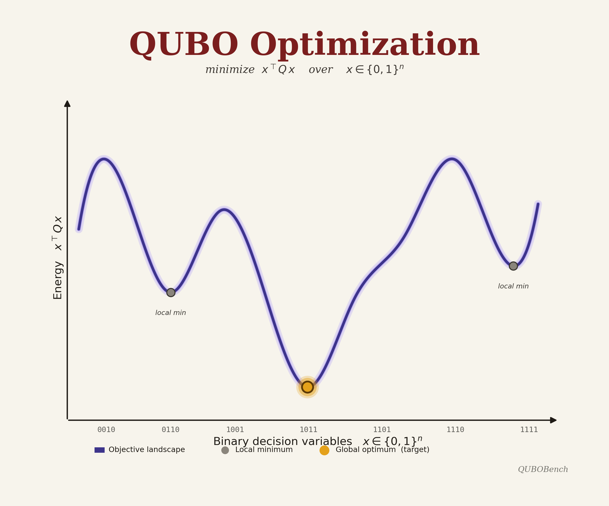
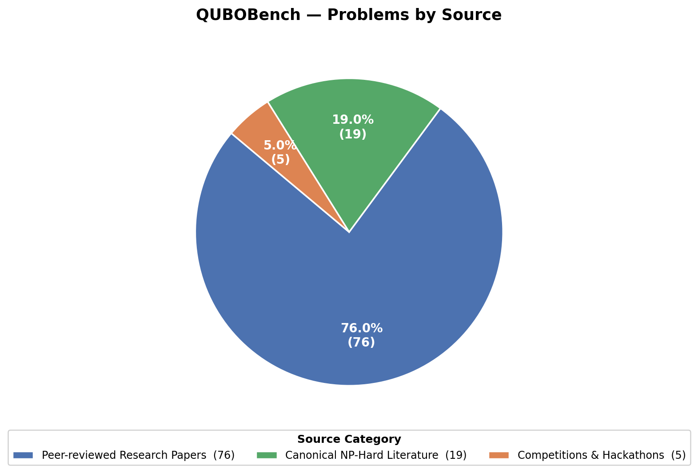
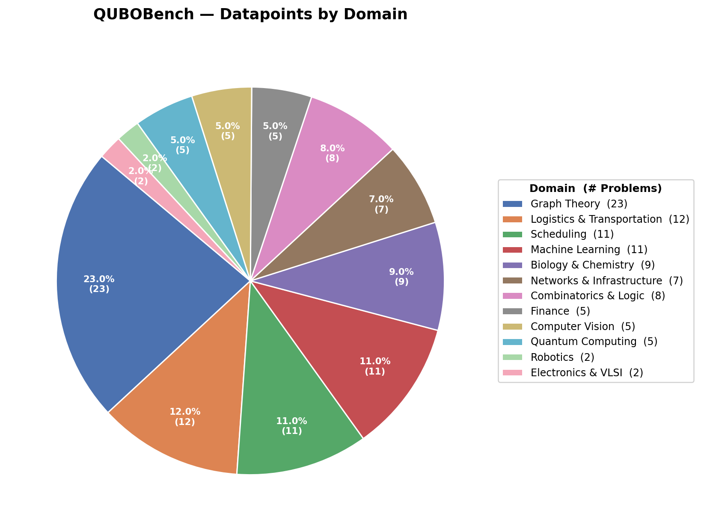

# QUBOBench

[](https://opensource.org/licenses/MIT)
[](https://openreview.net/forum?id=9YTedapat4)
[](https://quitttcat.github.io/QUBOBench)

## A Comprehensive Benchmark for Evaluating LLMs on the QUBO Formulation Task for NP-Hard Combinatorial Optimization Across Diverse Application Domains

📄 **Paper:** [QuantumQUBO Agent: Automating QUBO Formulation Generation from Natural Language](https://openreview.net/forum?id=9YTedapat4) — *ICML 2026 Workshop: AI as a Tool for Mathematics, Computer Science, and Machine Learning*
🌐 **Website:** [https://quitttcat.github.io/QUBOBench](https://quitttcat.github.io/QUBOBench)



**QUBOBench** is a benchmark for evaluating Large Language Models (LLMs) on 
Quadratic Unconstrained Binary Optimization (QUBO) problems. The dataset 
comprises problem instances spanning 12 application domains, encompassing 
classical graph-theoretic and combinatorial problems (e.g., Max-Cut, Maximum 
Independent Set, Graph Coloring, Hamiltonian Path), logistics and scheduling 
(Vehicle Routing, Job Shop Scheduling, Bin Packing), machine learning tasks 
formulated as discrete optimization (feature selection, k-means and k-medoids 
clustering, Bayesian network structure learning), computational biology and 
chemistry (RNA folding, protein lattice folding, molecular conformation 
selection), finance (portfolio optimization, credit scorecard selection), 
computer vision (image segmentation, denoising, stereo matching), networks 
and infrastructure (sensor placement, distribution-network reconfiguration), 
and quantum computing itself (qubit allocation, circuit compilation, prime 
factorization). 

## Instances are curated from three sources:



### 1. Peer-reviewed research papers — 76 problems
Journal articles and conference papers with a DOI, spanning the following venues (most renowned first):

**Journals —** *The Journal of Finance*, *Management Science*, *Artificial Intelligence*, *PLOS Computational Biology*, *PLOS ONE*, *Nature Scientific Reports*, *npj Quantum Information*, *npj Unconventional Computing*, *Physical Review Research*, *Journal of Chemical Theory and Computation*, *Theoretical Computer Science*, *Quantum Machine Intelligence*, *Quantum Information Processing*, *Annals of Operations Research*, *Journal of Combinatorial Optimization*, *Journal of Optimization Theory and Applications*, *Applied Soft Computing*, *Future Generation Computer Systems*, *Neurocomputing*, *Electric Power Systems Research*, *Discrete Optimization*, *IEEE Transactions on Quantum Engineering*, *IEEE Internet of Things Journal*, *IEEE Computer Graphics and Applications*, *Entropy*, *Applied Sciences*, *Journal of Risk and Financial Management*, *Frontiers in Physics*, *Frontiers in Computer Science*, *Frontiers in ICT*, *Bioinformatics Advances*, *International Journal for Numerical Methods in Engineering*, *EPJ Quantum Technology*, *Results in Engineering*, *Array*, *SN Computer Science*, *Journal of Membrane Computing*, *IEICE Communications Express*, *Journal of Information Processing*, *Highlights in Science Engineering and Technology*, *Tuijin Jishu / Journal of Propulsion Technology*

**Conferences —** *AAAI*, *ACM SIGKDD*, *ACM/SIGDA FPGA*, *IEEE BigData*, *IEEE GLOBECOM*, *IEEE QAI*, *IEEE QCE*, *IEEE EIT*, *ICCSA*, *JSME Robotics and Mechatronics*, *IFAC*

### 2. Problems posed in competitions and hackathons — 5 problems
- Fixstars Amplify Benchmark Suite
- Aqora / U.S. DOE Global Industry Challenge 2026
- iQuHACK 2025 D-Wave Hackathon
- AtCoder Educational DP Contest
- D-Wave Examples Repository

### 3. Canonical NP-hard problems from the combinatorial optimization literature — 19 problems
Classic decision and optimization problems (Max-Cut, Hamiltonian Cycle, Travelling Salesman, Subset Sum, Vertex Cover, etc.) drawn primarily from Lucas (2014) *"Ising formulations of many NP problems"* and hand-curated textbook instances.


---

## Overview

| | |
|---|---|
| **Total Datapoints** | 100 |
| **Total Test Cases** | 200 |
| **Total Domains** | 12 |

Each datapoint contains a natural-language problem description (prompt.txt) with a sample test case (sample_cases.txt) file containing several natural-language test cases that explain the solution configuration and ground truth. The test case sources are mentioned.

---

## Per-Domain Datapoints

| Domain | Datapoints | Test Cases |
|---|---|---|
| Graph Theory | 23 | 49 |
| Scheduling | 11 | 25 |
| Machine Learning | 11 | 22 |
| Logistics & Transportation | 12 | 21 |
| Biology & Chemistry | 9 | 19 |
| Networks & Infrastructure | 7 | 15 |
| Combinatorics & Logic | 8 | 11 |
| Finance | 5 | 10 |
| Computer Vision | 5 | 10 |
| Quantum Computing | 5 | 10 |
| Robotics | 2 | 4 |
| Electronics & VLSI | 2 | 4 |



---

## Dataset

| Problem | Test Cases | Domain | Source |
|---|---|---|---|
| Alkane Isomer Search | 2 | Biology & Chemistry | [10.1371/journal.pone.0226787](https://doi.org/10.1371/journal.pone.0226787) |
| Clinical Enzyme Target Identification | 2 | Biology & Chemistry | [10.1093/bioadv/vbad112](https://doi.org/10.1093/bioadv/vbad112) |
| Electronic Structure Eigensolver | 2 | Biology & Chemistry | [10.1038/s41598-020-77315-4](https://doi.org/10.1038/s41598-020-77315-4) |
| Fragment Flexible Docking | 2 | Biology & Chemistry | [10.3390/e26050397](https://doi.org/10.3390/e26050397) |
| Genome Assembly | 1 | Biology & Chemistry | [10.1038/s41598-021-88321-5](https://doi.org/10.1038/s41598-021-88321-5) |
| Ligand Pose Hotspot Sampling | 3 | Biology & Chemistry | [arXiv:2507.20304](https://doi.org/10.48550/arXiv.2507.20304) |
| Molecular Conformation Selection | 2 | Biology & Chemistry | [10.1038/s41598-019-47298-y](https://doi.org/10.1038/s41598-019-47298-y) |
| Protein Lattice Folding | 2 | Biology & Chemistry | [10.1038/srep00571](https://doi.org/10.1038/srep00571) |
| RNA Folding | 3 | Biology & Chemistry | [10.1371/journal.pcbi.1010032](https://doi.org/10.1371/journal.pcbi.1010032) |
| Clique Cover | 2 | Graph Theory | [10.3389/fphy.2014.00005](https://doi.org/10.3389/fphy.2014.00005) |
| Community Detection | 2 | Graph Theory | [10.1371/journal.pone.0227538](https://doi.org/10.1371/journal.pone.0227538) |
| Connectomics Community Detection | 2 | Graph Theory | [10.1038/s41598-023-30579-y](https://doi.org/10.1038/s41598-023-30579-y) |
| Core-Periphery Partitioning | 2 | Graph Theory | [10.1145/3534678.3539261](https://doi.org/10.1145/3534678.3539261) |
| Densest k-Subgraph | 2 | Graph Theory | [10.1007/s41965-019-00030-1](https://doi.org/10.1007/s41965-019-00030-1) |
| Dominating Set | 1 | Graph Theory | [10.3389/fphy.2014.00005](https://doi.org/10.3389/fphy.2014.00005) |
| Feedback Arc Set | 1 | Graph Theory | [10.3389/fphy.2014.00005](https://doi.org/10.3389/fphy.2014.00005) |
| Feedback Vertex Set | 1 | Graph Theory | [10.3389/fphy.2014.00005](https://doi.org/10.3389/fphy.2014.00005) |
| Graph Bandwidth | 1 | Graph Theory | [10.3389/fphy.2014.00005](https://doi.org/10.3389/fphy.2014.00005) |
| Graph Coloring | 2 | Graph Theory | [10.1371/journal.pone.0050060](https://doi.org/10.1371/journal.pone.0050060) |
| Graph Isomorphism | 2 | Graph Theory | [10.1016/j.tcs.2017.04.016](https://doi.org/10.1016/j.tcs.2017.04.016) |
| Hamiltonian Cycle | 1 | Graph Theory | [10.3389/fphy.2014.00005](https://doi.org/10.3389/fphy.2014.00005) |
| Hamiltonian Path | 2 | Graph Theory | [10.3389/fphy.2014.00005](https://doi.org/10.3389/fphy.2014.00005) |
| Longest Path | 1 | Graph Theory | [10.3389/fphy.2014.00005](https://doi.org/10.3389/fphy.2014.00005) |
| Maximum Clique | 4 | Graph Theory | [10.3389/fphy.2014.00005](https://doi.org/10.3389/fphy.2014.00005) |
| Maximum Cut | 8 | Graph Theory | [10.3389/fphy.2014.00005](https://doi.org/10.3389/fphy.2014.00005) |
| Maximum Independent Set | 5 | Graph Theory | Hand curated |
| Minimum Bisection | 1 | Graph Theory | [10.3389/fphy.2014.00005](https://doi.org/10.3389/fphy.2014.00005) |
| Minimum Multicut (Tree) | 2 | Graph Theory | [10.1038/s41598-019-53585-5](https://doi.org/10.1038/s41598-019-53585-5) |
| Social Influence Maximization | 2 | Graph Theory | [10.1109/GLOBECOM48099.2022.10000698](https://doi.org/10.1109/GLOBECOM48099.2022.10000698) |
| Steiner Tree | 1 | Graph Theory | [10.3389/fphy.2014.00005](https://doi.org/10.3389/fphy.2014.00005) |
| Top Eigencentrality Nodes | 2 | Graph Theory | [10.1371/journal.pone.0271292](https://doi.org/10.1371/journal.pone.0271292) |
| Vertex Cover | 1 | Graph Theory | [arXiv:1811.11538](https://doi.org/10.48550/arXiv.1811.11538) |
| Asset Exchange (QUBO-Plus) | 2 | Finance | [10.1007/s10479-022-04695-3](https://doi.org/10.1007/s10479-022-04695-3) |
| Credit Scorecard Selection | 2 | Finance | [10.54097/hset.v68i.12092](https://doi.org/10.54097/hset.v68i.12092) |
| Finance Fraud Feature Selection | 2 | Finance | [10.1609/aaaiss.v7i1.36910](https://doi.org/10.1609/aaaiss.v7i1.36910) |
| IonQ Trapped-Ion Portfolio Decomposition | 2 | Finance | [arXiv:2602.23976](https://arxiv.org/abs/2602.23976) |
| Portfolio Optimization | 2 | Finance | [10.1111/j.1540-6261.1952.tb01525.x](https://doi.org/10.1111/j.1540-6261.1952.tb01525.x) |
| Bin Packing | 2 | Logistics & Transportation | [10.1038/s41598-023-50540-3](https://doi.org/10.1038/s41598-023-50540-3) |
| Capacitated Facility Location | 1 | Logistics & Transportation | [10.1016/j.rineng.2025.108373](https://doi.org/10.1016/j.rineng.2025.108373) |
| Combinatorial Auction Winner | 2 | Logistics & Transportation | [10.1287/mnsc.1040.0336](https://doi.org/10.1287/mnsc.1040.0336) |
| Facility Location | 2 | Logistics & Transportation | [10.1016/j.rineng.2025.108373](https://doi.org/10.1016/j.rineng.2025.108373) |
| Generalized Assignment | 1 | Logistics & Transportation | [10.1007/s10878-014-9734-0](https://doi.org/10.1007/s10878-014-9734-0) |
| iQuHACK Multi-Vehicle Delivery | 2 | Logistics & Transportation | [GitHub: iQuHACK/2025-D-Wave](https://github.com/iQuHACK/2025-D-Wave) |
| Knapsack | 3 | Logistics & Transportation | [AtCoder DP Contest, Problem D](https://atcoder.jp/contests/dp/tasks/dp_d) |
| Quadratic Assignment | 1 | Logistics & Transportation | [10.1007/s10878-014-9734-0](https://doi.org/10.1007/s10878-014-9734-0) |
| Supply Chain Allocation | 2 | Logistics & Transportation | [10.1038/s41598-023-31765-8](https://doi.org/10.1038/s41598-023-31765-8) |
| Traffic Route Assignment | 2 | Logistics & Transportation | [10.3389/fict.2017.00029](https://doi.org/10.3389/fict.2017.00029) |
| Travelling Salesman | 1 | Graph Theory | [10.3389/fphy.2014.00005](https://doi.org/10.3389/fphy.2014.00005) |
| Vehicle Routing | 2 | Logistics & Transportation | [10.1038/s41598-024-70649-3](https://doi.org/10.1038/s41598-024-70649-3) |
| Balanced K-Means Clustering | 2 | Machine Learning | [10.1038/s41598-021-89461-4](https://doi.org/10.1038/s41598-021-89461-4) |
| Bayesian Network Learning | 2 | Machine Learning | [10.1609/aaai.v39i11.33234](https://doi.org/10.1609/aaai.v39i11.33234) |
| Brain-Inspired Sparse Coding | 2 | Machine Learning | [10.1038/s44335-025-00028-2](https://doi.org/10.1038/s44335-025-00028-2) |
| Cyber Risk Scoring | 2 | Machine Learning | [arXiv:2512.18305](https://doi.org/10.48550/arXiv.2512.18305) |
| Cybersecurity Intrusion Feature Selection | 2 | Machine Learning | [10.1109/EIT64391.2025.11103662](https://doi.org/10.1109/EIT64391.2025.11103662) |
| Feature Selection | 2 | Machine Learning | [10.1007/s42484-023-00099-z](https://doi.org/10.1007/s42484-023-00099-z) |
| k-Medoids Clustering | 2 | Machine Learning | [10.3390/jrfm14010034](https://doi.org/10.3390/jrfm14010034) |
| Legal Document Summarization | 2 | Machine Learning | [10.1038/s41598-022-20853-w](https://doi.org/10.1038/s41598-022-20853-w) |
| LLM Cascade Routing | 2 | Machine Learning | [10.20944/preprints202604.0413.v2](https://doi.org/10.20944/preprints202604.0413.v2) |
| Recommender Feature Selection | 2 | Machine Learning | [10.3390/e23080970](https://doi.org/10.3390/e23080970) |
| SVM Training | 2 | Machine Learning | [10.1038/s41598-021-89461-4](https://doi.org/10.1038/s41598-021-89461-4) |
| Aqora Energy Storage & Microgrid Siting | 2 | Networks & Infrastructure | [aqora.io/competitions/gic-2026-US-DOE](https://aqora.io/competitions/gic-2026-US-DOE) |
| Cloud-Edge Resource Allocation | 2 | Networks & Infrastructure | [10.1109/TQE.2024.3398410](https://doi.org/10.1109/TQE.2024.3398410) |
| Database Serializability Verification | 3 | Networks & Infrastructure | [10.1109/BigData59044.2023.10386188](https://doi.org/10.1109/BigData59044.2023.10386188) |
| Distribution Network Reconfiguration | 2 | Networks & Infrastructure | [10.1038/s41598-023-37293-9](https://doi.org/10.1038/s41598-023-37293-9) |
| Dynamic Spectrum Allocation | 2 | Networks & Infrastructure | [10.1587/comex.2021XBL0047](https://doi.org/10.1587/comex.2021XBL0047) |
| IoT/MEC AIGC Server Selection | 2 | Networks & Infrastructure | [10.1109/JIOT.2025.3649393](https://doi.org/10.1109/JIOT.2025.3649393) |
| Sensor Placement (Mutual Information) | 2 | Networks & Infrastructure | [arXiv:2407.14747](https://doi.org/10.48550/arXiv.2407.14747) |
| Exact Cover by 3-Sets | 1 | Combinatorics & Logic | [10.3389/fphy.2014.00005](https://doi.org/10.3389/fphy.2014.00005) |
| k-SAT | 2 | Combinatorics & Logic | [arXiv:2204.13539](https://doi.org/10.48550/arXiv.2204.13539) |
| Max 2-SAT | 1 | Combinatorics & Logic | [10.3389/fphy.2014.00005](https://doi.org/10.3389/fphy.2014.00005) |
| N-Queens (Exact Cover) | 1 | Combinatorics & Logic | [10.3389/fphy.2014.00005](https://doi.org/10.3389/fphy.2014.00005) |
| Number Partition | 2 | Combinatorics & Logic | [10.3389/fphy.2014.00005](https://doi.org/10.3389/fphy.2014.00005) |
| Set Cover | 2 | Combinatorics & Logic | [10.1038/srep33957](https://doi.org/10.1038/srep33957) |
| Set Packing | 1 | Combinatorics & Logic | [10.1007/s10479-022-04634-2](https://doi.org/10.1007/s10479-022-04634-2) |
| Subset Sum | 1 | Combinatorics & Logic | [10.3389/fphy.2014.00005](https://doi.org/10.3389/fphy.2014.00005) |
| Cryptanalysis / Prime Factorization | 2 | Quantum Computing | [10.1038/s41598-018-36058-z](https://doi.org/10.1038/s41598-018-36058-z) |
| FIFO Stack-Up (Quantum) | 2 | Quantum Computing | [10.1007/s42979-024-03082-y](https://doi.org/10.1007/s42979-024-03082-y) |
| Quantum Circuit Compilation | 2 | Quantum Computing | [10.1103/hcz4-nv2y](https://doi.org/10.1103/hcz4-nv2y) |
| Quantum Circuit Routing | 2 | Quantum Computing | [10.1007/s10957-023-02229-w](https://doi.org/10.1007/s10957-023-02229-w) |
| Qubit Allocation | 2 | Quantum Computing | [arXiv:2009.00140](https://doi.org/10.48550/arXiv.2009.00140) |
| Inverse Kinematics | 2 | Robotics | [10.1038/s41598-025-34346-z](https://doi.org/10.1038/s41598-025-34346-z) |
| Robot Arm Path Planning | 2 | Robotics | [10.1299/jsmermd.2024.1P2-L06](https://doi.org/10.1299/jsmermd.2024.1P2-L06) |
| Amplify Benchmark Job Selection | 2 | Scheduling | [GitHub: fixstars/amplify-benchmark](https://github.com/fixstars/amplify-benchmark) |
| Energy Storage Scheduling | 2 | Scheduling | [10.1007/978-3-030-75004-6_17](https://doi.org/10.1007/978-3-030-75004-6_17) |
| Exam Timetabling | 3 | Scheduling | [10.1016/j.asoc.2025.113756](https://doi.org/10.1016/j.asoc.2025.113756) |
| Hospital Staff Rescheduling | 3 | Scheduling | [10.1038/s41598-019-49172-3](https://doi.org/10.1038/s41598-019-49172-3) |
| Job Shop Scheduling | 2 | Scheduling | [10.1038/s41598-022-10169-0](https://doi.org/10.1038/s41598-022-10169-0) |
| Mars Satellite Observation Scheduling | 2 | Scheduling | [10.1109/QAI63978.2025.00043](https://doi.org/10.1109/QAI63978.2025.00043) |
| Nurse Scheduling | 2 | Scheduling | [10.1038/s41598-019-49172-3](https://doi.org/10.1038/s41598-019-49172-3) |
| OS Task Scheduling | 3 | Scheduling | [10.1016/j.array.2023.100282](https://doi.org/10.1016/j.array.2023.100282) |
| Railway Dispatching | 2 | Scheduling | [10.3390/e25020191](https://doi.org/10.3390/e25020191) |
| Resource-Constrained Project Scheduling | 2 | Scheduling | [10.1038/s41598-024-67168-6](https://doi.org/10.1038/s41598-024-67168-6) |
| Unit Commitment | 2 | Scheduling | [10.1016/j.epsr.2024.111121](https://doi.org/10.1016/j.epsr.2024.111121) |
| Image Denoising | 2 | Computer Vision | [10.3389/fcomp.2023.1281100](https://doi.org/10.3389/fcomp.2023.1281100) |
| Image Segmentation (Graph Cut) | 2 | Computer Vision | [10.1109/MCG.2024.3455012](https://doi.org/10.1109/MCG.2024.3455012) |
| Phase Field Correction | 2 | Computer Vision | [10.1002/nme.70019](https://doi.org/10.1002/nme.70019) |
| Remote Sensing Segmentation (QSEG) | 2 | Computer Vision | [10.1109/MCG.2024.3455012](https://doi.org/10.1109/MCG.2024.3455012) |
| Stereo Matching | 2 | Computer Vision | [10.3390/e20100786](https://doi.org/10.3390/e20100786) |
| FPGA Placement | 2 | Electronics & VLSI | [10.1145/3626202.3637619](https://doi.org/10.1145/3626202.3637619) |
| VLSI Bisection Placement | 2 | Electronics & VLSI | [10.52783/tjjpt.v46.i03.9844](https://doi.org/10.52783/tjjpt.v46.i03.9844) |

---

## Citation

If you use QUBOBench in your research, please cite:

```bibtex
@inproceedings{mondal2026quantumqubo,
  title     = {QuantumQUBO Agent: Automating Quadratic Unconstrained Binary Optimization (QUBO) Formulation Generation from Natural Language},
  author    = {Niloy Kumar Mondal and Md Rizwan Parvez},
  booktitle = {ICML 2026 Workshop: AI as a Tool for Mathematics, Computer Science, and Machine Learning},
  year      = {2026},
  url       = {https://openreview.net/forum?id=9YTedapat4}
}
```

## License

This project is released under the [MIT License](LICENSE).
